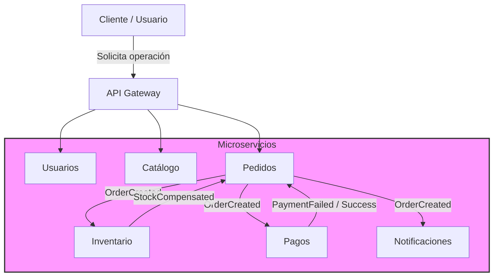

# 3) Arquitectura de Microservicios para Aplicación de Comercio Electrónico

## Planteamiento del Problema
Diseña la arquitectura de un sistema de microservicios para una aplicación de comercio electrónico que debe manejar altos volúmenes de transacciones, implementar escalabilidad dinámica y tolerancia a fallos. Utiliza un esquema que considere tanto la comunicación entre servicios como la seguridad.

---
## Propuesta de Solución

Mi propuesta para dar cumplimiento a la solución planteada consiste en:

## 1. Enfoque General

La solución está basada en un ecosistema de **microservicios desacoplados** que siguen los principios de **CQRS** y **event-driven architecture**. Cada servicio tiene responsabilidad única y se comunica con otros mediante un **broker de mensajería** (Kafka, RabbitMQ, AWS SNS/SQS).  

- CQRS separa comandos (writes) de consultas (reads), optimizando rendimiento y escalabilidad.  
- Cada microservicio maneja su propia lógica de transacciones y rollback, sin utilizar procedimientos almacenados.  
- Se garantiza tolerancia a fallos mediante **sagas, compensaciones, circuit breakers** y mensajería confiable.  
- La arquitectura es agnóstica al lenguaje de programación, permitiendo usar distintos stacks tecnológicos.

---

## 2. Microservicios Clave

| Microservicio      | Función Principal |
|-------------------|-----------------|
| **Usuarios**       | Gestión de cuentas, autenticación y roles. |
| **Catálogo**       | Gestión de productos, precios y disponibilidad. |
| **Pedidos**        | Registro y coordinación de órdenes, publica eventos de estado. |
| **Inventario**     | Actualiza stock en tiempo real, responde a eventos de pedidos. |
| **Pagos**          | Procesa pagos y publica eventos de éxito/fallo de transacción. |
| **Notificaciones** | Envía emails, SMS o push de estados de pedidos/pagos. |

---

## 3. Comunicación y Mensajería

- **Mensajería basada en eventos** para desacoplar servicios y manejar picos de carga.
  - Ejemplo: cuando **Pedidos** confirma un pedido, se publica `OrderCreated` que **Inventario**, **Pagos** y **Notificaciones** consumen.
- **API Gateway** para solicitudes externas, autenticación y enrutamiento.
- **Broker de mensajes** garantiza entrega confiable y ordenada.
- **Circuit breakers** y **retry policies** para manejar fallos entre servicios.

---

## 4. Manejo de Transacciones y Rollback

- Cada servicio gestiona su **propia base de datos y lógica de persistencia**.  
- Las transacciones distribuidas se implementan mediante **sagas**:
  - Cada comando que modifica estado tiene un **evento compensador** que revierte la acción si falla alguna etapa.
  - Ejemplo: si un pago falla después de reservar inventario, se publica `CompensateInventory` para devolver stock.
- Se evita el uso de **procedimientos almacenados**, centralizando la lógica de negocio en la capa de aplicación.

---

## 5. Escalabilidad Dinámica y Tolerancia a Fallos

- Microservicios escalables horizontalmente mediante contenedores (Docker/Kubernetes).  
- CQRS separa comandos y consultas, optimizando la escalabilidad de lectura/escritura.  
- **Replicación de bases de datos** y **multi-zona** para alta disponibilidad.  
- Monitoreo centralizado y logging distribuido para detectar y recuperarse de fallos rápidamente.

---

## 6. Seguridad

- **Autenticación centralizada** con JWT/OAuth2.  
- **Comunicación segura** entre servicios mediante TLS.  
- **Segregación de datos**: cada servicio accede únicamente a su propia base de datos.  
- **Auditoría de eventos y transacciones** para trazabilidad completa.

---

## 7. Argumentos Clave del Diseño

1. CQRS y mensajería basada en eventos permiten desacoplar servicios, escalar dinámicamente y tolerar fallos sin afectar otras partes del sistema.  
2. Rollback en la capa de aplicación asegura consistencia sin depender de procedimientos almacenados.  
3. Arquitectura agnóstica al lenguaje: los servicios pueden implementarse en cualquier lenguaje compatible con mensajería estándar y REST/GRPC.  
4. Seguridad y resiliencia integradas, con monitoreo, circuit breakers y políticas de retry.

---

## 8. Diagrama Conceptual (Mermaid)

Este diagrama representa la comunicación entre clientes, API Gateway y microservicios. Las líneas representan eventos y llamadas API, siguiendo CQRS y arquitectura basada en eventos.

### Ventajas clave:

**Desacoplamiento:** Cada microservicio se comunica a través de eventos y no depende directamente de otros servicios para continuar su proceso. Esto permite que cada servicio evolucione de manera independiente y se escale sin afectar a otros.

**Escalabilidad y Resiliencia:** El uso de eventos y mensajería permite manejar picos de carga sin bloqueos, garantizando que el sistema sea resistente a fallos. En caso de que un servicio esté inactivo o sobrecargado, los eventos se almacenan y procesan cuando sea posible.

**Asincronía y fiabilidad:** Los eventos se procesan de manera asíncrona, lo que permite que las operaciones se realicen de forma eficiente sin que el sistema se vea bloqueado por transacciones que dependan de respuestas inmediatas.

De esta manera, los servicios se comunican entre sí a través de estos eventos para garantizar que todo el proceso de compra y pago sea fluido y sin bloqueos.

#### Explicación de los Eventos

1. **Pedidos → Inventario | `OrderCreated`**  
   Cuando un cliente hace un pedido, el sistema de pedidos notifica al sistema de inventario para que se actualice el stock de los productos comprados. Así, el inventario se gestiona de manera automática y sin esperar a que el pedido se complete.

2. **Pedidos → Pagos | `OrderCreated`**  
   Cuando el pedido se crea, el sistema de pedidos informa al sistema de pagos para que se procese la transacción. Esto permite que el proceso de pago comience sin que el sistema de pedidos dependa directamente de él.

3. **Pedidos → Notificaciones | `OrderCreated`**  
   Cuando el pedido se registra, el sistema de pedidos envía una notificación al sistema de comunicaciones para que le envíe al cliente un correo o mensaje confirmando su compra. Esto mantiene al cliente informado de manera rápida y automática.

4. **Pagos → Pedidos | `PaymentFailed / Success`**  
   Después de procesar el pago, el sistema de pagos notifica al sistema de pedidos si el pago fue exitoso o falló. Si el pago fue correcto, el pedido se completa, y si no, se puede cancelar o ajustar el pedido.

5. **Inventario → Pedidos | `StockCompensated`**  
   Si el inventario se ve afectado por un error (como no tener suficientes productos), el sistema de inventario le avisa al sistema de pedidos para que se tomen medidas como cancelar el pedido o reembolsar al cliente.

De esta manera, los servicios se comunican entre sí a través de estos eventos para garantizar que todo el proceso de compra y pago sea fluido y sin bloqueos.

## Dagrama de Contexto general

Este diagrama muestra la arquitectura de alto nivel del sistema y cómo los actores (como los usuarios) interactúan con los microservicios a través de la API Gateway, que sirve como punto de entrada a los diferentes microservicios de comercio electrónico.

## Diagrama de Contenedores

Este diagrama muestra los contenedores dentro del sistema. En este caso, cada microservicio se implementa como un contenedor dentro del sistema de comercio electrónico. La API Gateway orquesta las comunicaciones, y los brokers de mensajería permiten una comunicación asíncrona.

